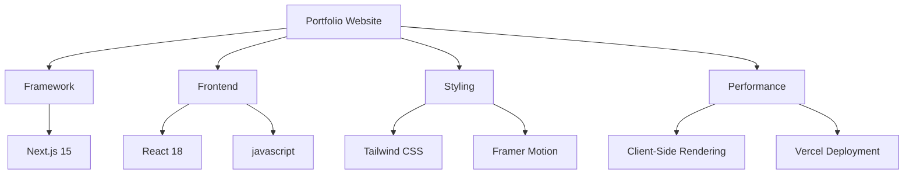

# ✨ Modern Portfolio Website

<div align="center">


[](https://nextjs.org/)
[](https://reactjs.org/)
[](https://www.typescriptlang.org/)
[](https://tailwindcss.com/)
[](https://vercel.com)

An elegant, modern portfolio showcasing my journey as a Full Stack Engineer through interactive designs and smooth animations.

[Live Demo](https://shubham-portfolio.vercel.app) • [GitHub](https://github.com/Shubhamkanskar/myportfolio) • [Report Bug](https://github.com/Shubhamkanskar/myportfolio/issues)

</div>


## 🌟 Features

- **🎨 Modern Dark Theme** - Elegant and eye-catching design
- **📱 Responsive Layout** - Mobile-first approach for all devices
- **🌐 Interactive UI** - Glassmorphism elements and smooth transitions
- **⚡ Performance** - Optimized loading and rendering
- **🎭 Animations** - Fluid motion using Framer Motion
- **🤝 Contact Modal** - Easy-to-reach communication channels

## 🛠️ Tech Stack



## 🚀 Quick Start

1. **Clone Repository**
   ```bash
   git clone https://github.com/Shubhamkanskar/myportfolio.git
   cd myportfolio
   ```

2. **Install Dependencies**
   ```bash
   npm install
   ```

3. **Start Development Server**
   ```bash
   npm run dev
   ```

4. **View Website**
   ```
   Open http://localhost:3000
   ```

## 🎯 Key Components

### Hero Section
- 🖼️ Animated profile with gradient border
- 🏷️ Floating technology tags
- ✨ Dynamic text animations
- 🔗 Quick-access contact buttons

### Projects Section
- 🎴 Interactive project cards
- 🔍 Live previews
- 💻 Source code links
- 🛠️ Tech stack indicators

### Contact Modal
- 📧 Multiple contact methods
- 🔄 Smooth transitions
- 🌐 Social media integration
- 👔 Professional details

## 👨‍💻 About Me

<div align="center">

### Shubham Kanaskar
Full Stack Engineer at DeployH.AI

📍 Pune, Maharashtra, India • 💼 9+ months experience

</div>

## 📮 Contact

<div align="center">

[](mailto:shubhamkanaskar75@gmail.com)
[](tel:+919623501027)
[](https://www.linkedin.com/in/shubham-kanaskar-237280157/)
[](https://github.com/Shubhamkanskar)

</div>

## 🔮 Future Enhancements

- [ ] 🌓 Dark/Light Theme Toggle
- [ ] 📱 Enhanced Mobile Responsiveness
- [ ] 🎯 Expanded Project Showcase
- [ ] 📄 Downloadable Resume Feature
- [ ] 📝 Blog Section Integration

## 📄 License
https://github.com/user-attachments/assets/03145d40-46ec-4d08-9847-4b8a3c7a9da5


This project is open source and available under the [MIT License](LICENSE).

## 🙏 Acknowledgments

- Next.js Team for the incredible framework
- Vercel for seamless hosting
- All contributors and supporters

---

<div align="center">

Made with ❤️ by [Shubham Kanaskar](https://github.com/Shubhamkanskar)

</div>
